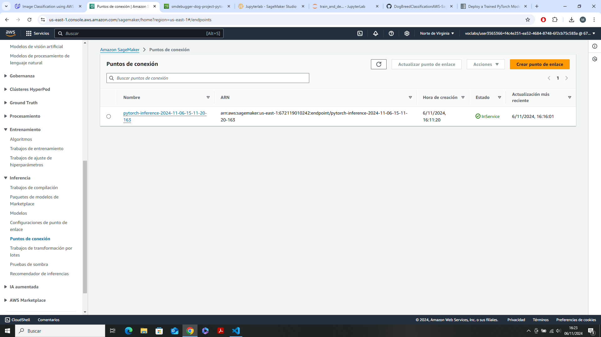

# Image Classification (Dog breed) using AWS SageMaker and PyTorch

Use AWS Sagemaker to train a pretrained model that can perform image classification by using the Sagemaker profiling, debugger, hyperparameter tuning and other good ML engineering practices. This can be done on either the provided dog breed classication data set or one of your choice.

The model chosen for this project is the Resnet50 model from pytorch library(https://pytorch.org/vision/master/generated/torchvision.models.resnet50.html)

## Project Set Up and Installation
Enter AWS through the gateway in the course and open SageMaker Studio. 
Download the starter files [GIT](https://github.com/udacity/CD0387-deep-learning-topics-within-computer-vision-nlp-project-starter)
Download/Make the dataset available. 
The notebook file train_and_deploy.ipynb is the main file and workflow for the project

#### Dataset
This project uses Udacity's Dog Breed Classification Data set.
The dataset can be downloaded [here](https://s3-us-west-1.amazonaws.com/udacity-aind/dog-project/dogImages.zip). 

### Access
Upload the data to an S3 bucket through the AWS Gateway so that SageMaker has access to the data. 

## Hyperparameter Tuning

- As stated before the model selected for the project is the ResNet50, which can be loaded with pretrained weights, trained with more than 1M of images from ImageNet database.
- After loaded the model, a fully connected layer is added on top of resnet50 to predict the 133 classes of different dog breeds
- The script used for the hyperparemeter tuning is 'hpo.py'
- The hyperparameters defined for this models are:
    - learning rate (lr): (0.001, 0.1),
    - batch-size: [32, 64, 128, 256, 512],
    - test-batch-size: [32, 64, 128, 256, 512],
    - epochs: (5, 8)
- After finishing all the training jobs, the following hyperparemeters are selected as the best (using metric minimize test loss):
{'_tuning_objective_metric': '"average test loss"',
 'batch-size': '"64"',
 'epochs': '8',
 'lr': '0.006071358381919446',
 'sagemaker_container_log_level': '20',
 'sagemaker_estimator_class_name': '"PyTorch"',
 'sagemaker_estimator_module': '"sagemaker.pytorch.estimator"',
 'sagemaker_job_name': '"pytorch-training-2024-11-05-19-08-16-771"',
 'sagemaker_program': '"hpo.py"',
 'sagemaker_region': '"us-east-1"',
 'sagemaker_submit_directory': '"s3://sagemaker-us-east-1-672119010242/pytorch-training-2024-11-05-19-08-16-771/source/sourcedir.tar.gz"',
 'test-batch-size': '"512"'}

 
 

## Debugging and Profiling
After the hyperparemeter tuning phase, is launched another training job with the best hyperparameters obtained, using the script 'train_model.py', and adding debugging and profiling config to it
### Results
Representation of the Cross Entropy Loss.

### Profiler Output
The profiler report can be found in HTML format [here](ProfilerReport/profiler-output/profiler-report.html).

## Model Deployment
After finished the training job with the best hyperparemeters, using the model generated by it and uploaded to s3, is deployed an endpoint with this model and using as entry point the script 'inference.py' to allowing performing inferences with it. The input for this endpoint must be an image in JPEG format, and the output is a json with and array of 133 probabilities of the dog being a certain breed.

## Test Inference

The resulting JSON obtained can be found here [here](result_inference_dog.json).

The position in the resulting array with the maximum probability is the 5, which corresponds in our dataset with the breed Alaskan malamute.